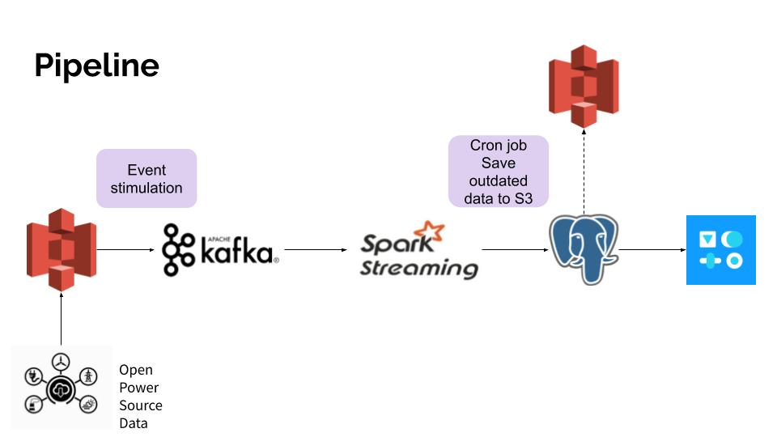

# Smart 
## Real time power tracking

With smart meters, power companies can easily monitor real-time energy usage, detect abnormal consumption to reduce blackouts.

[Presentation](https://docs.google.com/presentation/d/1wlVYwPeA40bu3ZdPmVV9QsoGN9PVOwfzJIskjYUxISw/edit?usp=sharing)
 
[Video demo](https://youtu.be/hBob4tnaT8w)

# Introduction

Electric utilities have begun to replace traditional analog meters with “smart meters”. Smart meters are much more efficient for utility providers, because they provide up-to-date information and can do many things remotely that required numerous employees to handle in the past.
Also, with smart meters, detecting abnormal usage like tampering or electricity theft will be easier.

# Architecture

# Dataset

The data is scaled and stimulated based on [Open Power System Data](https://data.open-power-system-data.org/household_data/).   
OPSD provides detailed household load and solar generation in minutely to hourly resolution. 

# Engineering Challenges 

* Using Spark structured streaming to gather one second interval events into five second interval to ease postgresql writing load.

