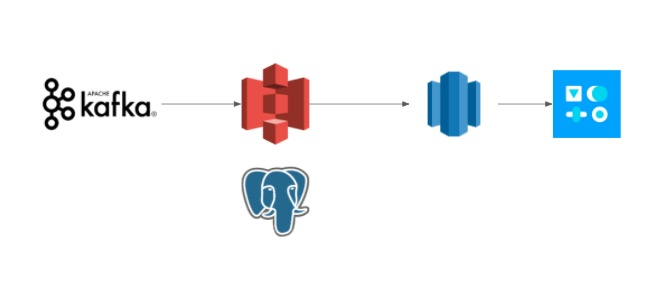

# Smart 
## Real time power tracking
Using stimulate smart meter data to create a real-time dashboard for power companies to monitor current energy usage, reduce blackouts and detect abnormal consumption.

[Presentation](https://docs.google.com/presentation/d/1wlVYwPeA40bu3ZdPmVV9QsoGN9PVOwfzJIskjYUxISw/edit?usp=sharing)
 
[Video demo](https://www.example.com)

# Introduction

Electric utilities have begun to replace traditional analog meters with “smart meters”. Smart meters are much more efficient for utility providers, because they provide up-to-date information and can do many things remotely that required numerous employees to handle in the past.
Also, with smart meters, detecting abnormal usage like tampering or electricity theft will be easier.

# Architecture

# Dataset

The data is scaled and stimulated based on [Open Power System Data](https://data.open-power-system-data.org/household_data/).   
OPSD provides detailed household load and solar generation in minutely to hourly resolution. 

<!---
# Engineering challenges
### Missing message while high throughput

### Query from large database

# Trade-offs
--->
