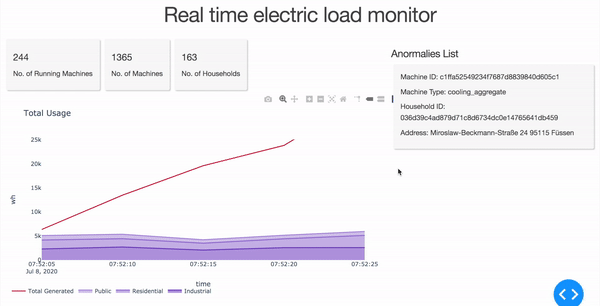

# UI MockUp

The dashboard is updated every 5 second,  user can easily check the number of machine that are currently running, the total usage of each type of household (public, residential, industrial), and the list of anomalies usage devices.

