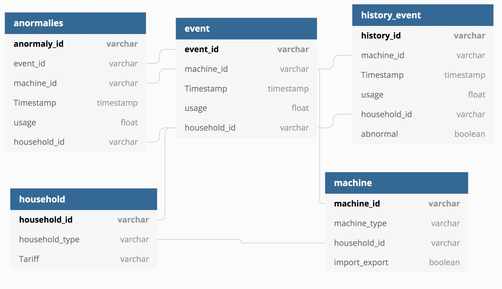

# Database Scripts

## Schema 

There are five tables in the database, the events are saved in the event tables, if the event is detected as an anomaly, it will also be written into anormalies table. The abnormal event detection is based on the device's machine type and history events.